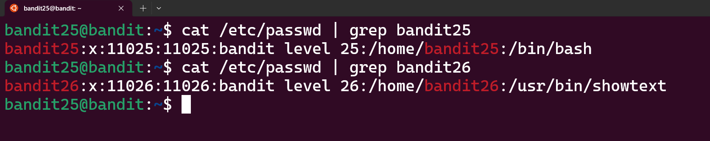
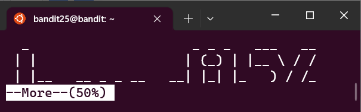
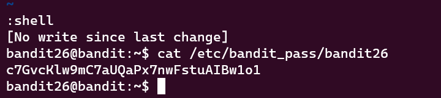

Bandit Level 25 → Level 26
Level Goal
Logging in to bandit26 from bandit25 should be fairly easy… The shell for user bandit26 is not /bin/bash, but something else. Find out what it is, how it works and how to break out of it.

Commands Used:
There is a private key in the file bandit26.sshkey in /home/bandit25 directory. If we use this private key to login as user bandit26 using command ssh -i bandit26.sshkey bandit26@localhost we are logged out. We receive a message “Connection to localhost closed”.

Lets find some information of user bandit25 and bandit26. bandit25 uses /bin/sh shell and bandit26 uses something /usr/bin/showtext.



Lets see what is inside the showtext file. The content is
```
#!/bin/sh

export TERM=linux

exec more ~/text.txt
exit 0
```


Before exiting, command more ~/text.txt is executed.

The more command is used in line 6 to open the file text.txt. more is useful to display long (text) files on small screens or in a size limited terminal window - similar to the less command, but with much fewer functions.
This means that we have to resize the currently used terminal window in size and make it so small to enter the more environment.

To enable more we have to decrease size of our terminal window.

Once the window is resized we enter the following command:
```
$ ssh -i bandit26.sshkey bandit26@localhost -p 2220
```

We know if we did this right if we see the following window


The most interesting command here is v, which will start the editor vi at the current line. From vi, as mentioned in the SANS Penetration Testing blog article , we can start a shell. Type in :set shell=/bin/bash within vi and type in :shell then.




Password:
c7GvcKlw9mC7aUQaPx7nwFstuAIBw1o1


