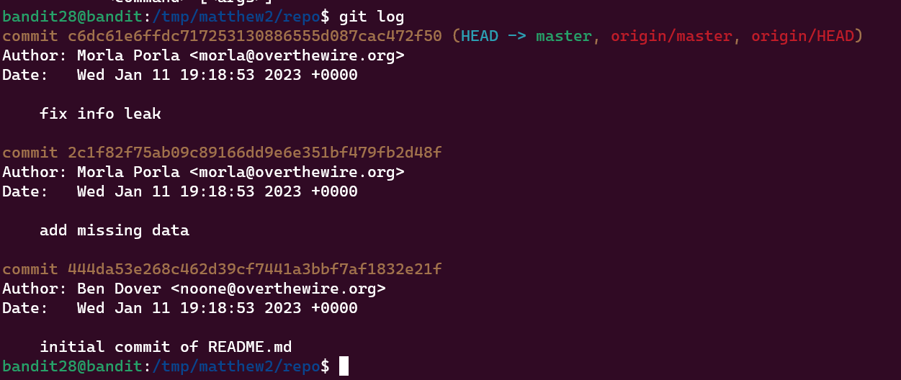
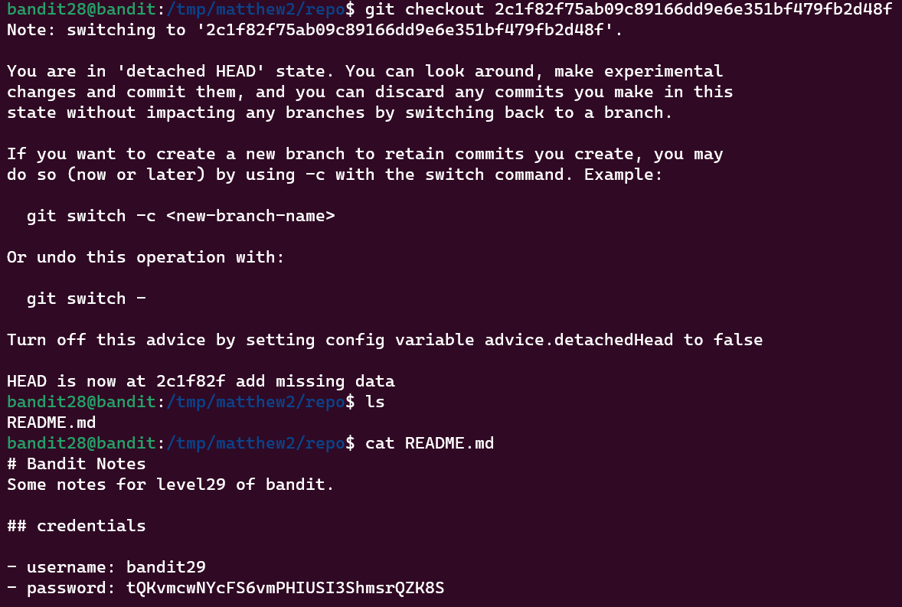

Bandit Level 28 → Level 29
Level Goal
There is a git repository at ssh://bandit28-git@localhost/home/bandit28-git/repo. The password for the user bandit28-git is the same as for the user bandit28.

Clone the repository and find the password for the next level.

Commands you may need to solve this level
git

Commands Used:

The command to clone the directory is as follows:
```
$ git clone ssh://bandit28-git@bandit.labs.overthewire.org:2220/home/bandit28-git
/repo.git/

```

This time cat'ing the README file does not reveal the password. We check the log to see if the file has any previous commits



The commit with missing data looks interesting so we can use ```git checkout``` to retrieve that data




Password:
tQKvmcwNYcFS6vmPHIUSI3ShmsrQZK8S
