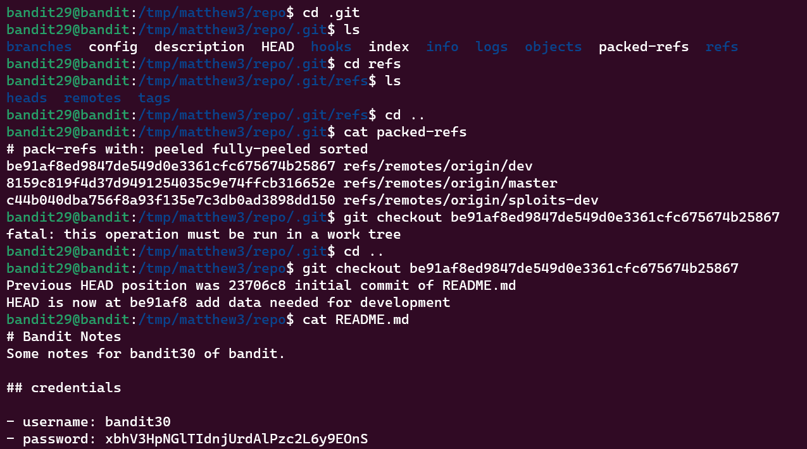

Bandit Level 29 → Level 30
Level Goal
There is a git repository at ssh://bandit29-git@localhost/home/bandit29-git/repo. The password for the user bandit29-git is the same as for the user bandit29.

Clone the repository and find the password for the next level.

Commands you may need to solve this level
git

Commands Used:
```
$ git clone ssh://bandit29-git@bandit.labs.overthewire.org:2220/home/bandit29-git/repo.git
```

```
$ ls -lah
$ cd .git
$ cd refs
$ cat packed-refs
```


Password:
xbhV3HpNGlTIdnjUrdAlPzc2L6y9EOnS