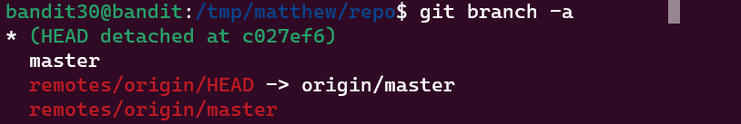
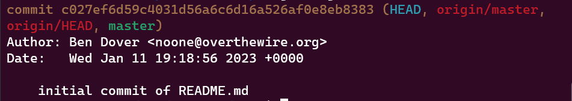
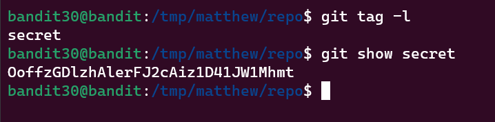

Bandit Level 30 → Level 31
Level Goal
There is a git repository at ssh://bandit30-git@localhost/home/bandit30-git/repo. The password for the user bandit30-git is the same as for the user bandit30.

Clone the repository and find the password for the next level.

Commands you may need to solve this level
git

Commands Used:
Lets first check if other branches are available.

This appears to be the only branch, so we will check the log next. 

There is nothing of interest here, just the inital commit

Let's check the tags next

Password:
OoffzGDlzhAlerFJ2cAiz1D41JW1Mhmt

