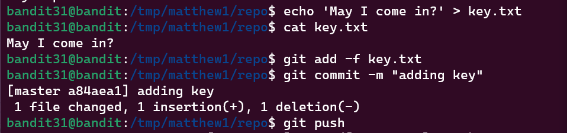

Bandit Level 31 → Level 32
Level Goal
There is a git repository at ssh://bandit31-git@localhost/home/bandit31-git/repo. The password for the user bandit31-git is the same as for the user bandit31.

Clone the repository and find the password for the next level.

Commands you may need to solve this level
git

Commands Used:
This invovled us making a file and pushing it

Passwords:
rmCBvG56y58BXzv98yZGdO7ATVL5dW8y