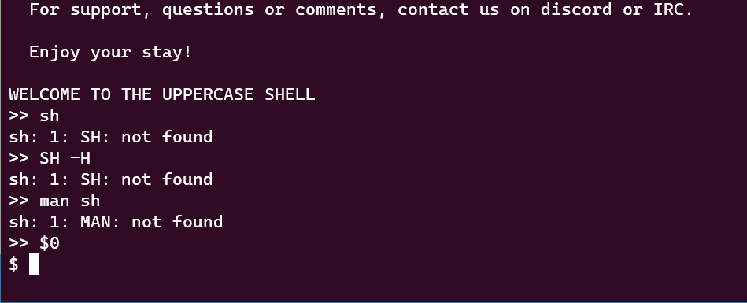
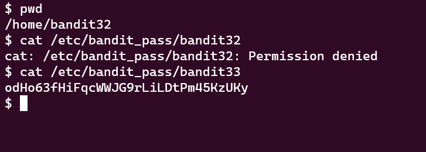

Bandit Level 32 → Level 33
After all this git stuff its time for another escape. Good luck!

Commands you may need to solve this level
sh, man


Commands Used:

No matter what commands we enter, they won't be recognized since they're shifted to uppercase. 

Reading the man page of ```sh``` we see that we can invoke a shell with the ```$0``` command. 




We then cat the bandit password like any other shell we've done



Password:
odHo63fHiFqcWWJG9rLiLDtPm45KzUKy


